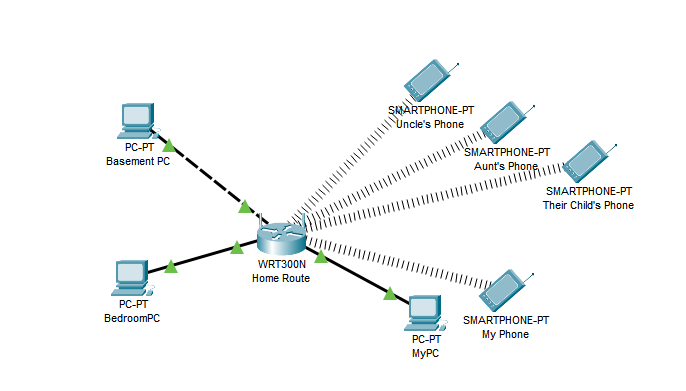
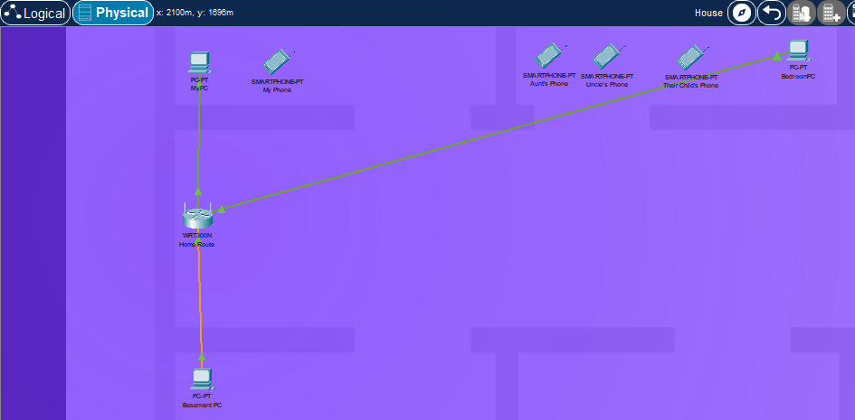

# Home Network Documentation

## Logical and Physical Topologies

## Addressing Documentation

| Device Name          | IP Address     |
|----------------------|-----------------|
| HomeRouter           | 192.168.1.1     |
| BasementPC           | 192.168.1.10    |
| BedroomPC            | 192.168.1.11    |
| MyPC                 | 192.168.1.12    |
| Uncle's Smartphone   | 192.168.1.13    |
| Aunt's Smartphone    | 192.168.1.14    |
| Child's Smartphone   | 192.168.1.15    |
| My Smartphone        | 192.168.1.16    |

## Device Information

| Device Name          | Description                                                                 |
|----------------------|-----------------------------------------------------------------------------|
| HomeRouter           | Router providing Wi-Fi access for devices in the home.                     |
| BasementPC           | Computer used for entertainment and hobbies.                                 |
| BedroomPC            | Computer used for work and studies.                                          |
| MyPC                 | Personal computer belonging to a guest.                                     |
| Uncle's Smartphone   | Android smartphone owned by the uncle.                                      |
| Aunt's Smartphone    | Android smartphone owned by the aunt.                                       |
| Child's Smartphone   | Android smartphone owned by the child.                                       |
| My Smartphone        | Android smartphone belonging to a guest.                                    |

## Maintaining Configurations

The house owner (Uncle) primarily manages the configurations of the router, BasementPC, and BedroomPC.  Guest-owned devices are managed by their respective owners.

## Security of Login Credentials

* The Wi-Fi password is set by the house owner (Uncle) to control network access.
* Individual device owners manage their login credentials.
* Two-Factor Authentication (2FA) is implemented for accounts where applicable.
